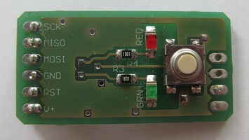
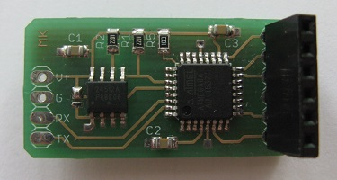

### AVR ISP bub

AVR ISP bub is a standalone AVR programmer. It uses ATmega8 as the brains and
24C512 64kb I2C EEPROM as storage for the target firmware.

[](images/IMG_2206.jpg)
[](images/IMG_2207.jpg)

The firmware image and target parameters are set via the serial interface. The
programmer is based on Bus gofer code so the serial commands are
mostly identical. Commands other than those necessary for programming the on-board
EEPROM have been removed and a new class of __AT+ISP...__ commands has been added.

The programmer's own firmware can be uploaded using the SPI pins (programming connector)
and the RST test pad. The fuses are out of the factory default.

To compile the sources my AVR library is required.

#### To upload your firmware image to the programmer

run

```
prg.py serial_if filename
```

for example:

```
prg.py com15 main.hex

000000 64 64 / 2978 ( 2 %) 0:00:00  left
000040 64 128 / 2978 ( 4 %) 0:00:11  left
000080 64 192 / 2978 ( 6 %) 0:00:14  left
0000c0 64 256 / 2978 ( 8 %) 0:00:15  left
000100 64 320 / 2978 ( 10 %) 0:00:15  left
...
000a80 64 2752 / 2978 ( 92 %) 0:00:01  left
000ac0 64 2816 / 2978 ( 94 %) 0:00:01  left
000b00 64 2880 / 2978 ( 96 %) 0:00:00  left
000b40 64 2944 / 2978 ( 98 %) 0:00:00  left
000b80 34 2978 / 2978 ( 100 %) 0:00:00  left

Device CRC: 9724
File CRC  : 9724
Done.
```

#### To define programming parameters

Use a terminal to connect to the MCU @4800 baud and issue the __AT+ISPTARGET=...__ command. For example:

```
AT+ISPTARGET=1e910a,32,2978,d7,f1,-,-,128,1000
OK
```

where the parameters are:

1. device signature (hex, 6 chars), the programmer will test the chip for matching sig
2. page size in bytes (dec), get this from the datasheet
3. firmware image size in bytes (dec), get from linker output or prg.py (2978 in the example above)
4. lfuse (hex, 2 chars) or - to not program
5. hfuse (hex, 2 chars) or - to not program
6. efuse (hex, 2 chars) or - to not program
7. lock  (hex, 2 chars) or - to not program
8. eeprom image size in bytes (dec) or 0 to not program
9. eeprom image start in 24C512 (hex, 4 chars)

The programming parameters are stored in the MCU's internal EEPROM.

Finally, check the parameters are correct by issuing __AT+ISPTARGET=?__

```
AT+ISPTARGET=?
sig 1e910a
pgsize 32
fwsize 2978
lfuse d7
hfuse f1
eeoffs 0x1000
eesize 128
OK
```

The programmer is now ready. You can either press the button to initiate programming or issue
the __AT+ISPPROGRAM__ command (mostly used for debugging). When programming, the red LED will
blink. Upon completion, the green LED will light up if everything went OK otherwise the red LED
will light up. If something goes wrong, you can listen to debug messages that are output on
the serial port.

If you're interested, issue __AT$__ to get a list of all supported AT commands.

#### Bill of materials

[](images/avrisp_sch.png)
[](images/avrisp_brd.png)

Qty | Value / Farnell code | Device | Size | Parts
----|----------------------|--------|------|-------
1 | 1908135 | 24C512       | SOIC8  | IC1
1 | 1748532 | ATmega8      | LQFP48 | IC2
2 | 2k      | resistor     | 0805   | R1,R2
2 | 1k      | resistor     | 0805   | R3,R4
1 | 4k7     | resistor     | 0805   | R5
3 | 100n    | multilayer   | 0805   | C1,C2,C3
1 | green   | chipled      | 1206   | GRN
1 | red     | chipled      | 1206   | RED
1 |         | button 6x6mm | SMD    | S1
